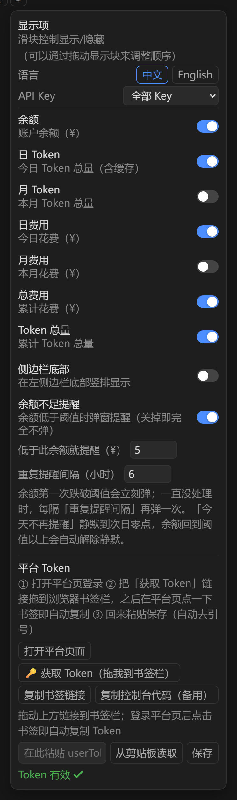
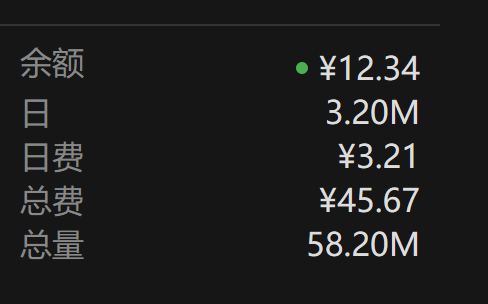

# DSH Deepseek Monitor

_✨ DeepSeek Harness 插件：余额、Token 用量与费用实时可见 ✨_

  
 
 

**中文** | [English](README_EN.md)

DeepSeek 用量监控 —— DeepSeek Harness (DSH) 插件：在会话头部与侧边栏实时显示
DeepSeek 平台的余额、日/月/累计 Token 总量与费用，支持拖拽排序与开关配置；另附一个本地用量代理，
为走 Anthropic 兼容协议的子代理（如 Claude Code）精确记账。

> 本插件使用 platform.deepseek.com Web 端内部接口（非公开契约）查询你自己的账户数据，仅限个人使用；
> 接口结构若被 DeepSeek 变更，需要同步更新 `lib/platform.mjs`。

## 安装

标准 DSH bundle 格式（根包即插件，既可从 npm 安装，也可从 GitHub 一条命令安装）。当前版本 `0.2.4`，npm 包名 `dsh-deepseek-monitor-moyuer233`。

```bash
# 从 npm 安装（推荐）
dsh plugin --profile web add dsh-deepseek-monitor-moyuer233

# 或直接从 GitHub 安装
dsh plugin --profile web add github:moyuer233/dsh-deepseek-monitor
```

装完重启 DSH（宿主在启动时加载新 bundle；此后客户端改动走 HMR，刷新页面即可）。

安装命令会把本仓库作为依赖装进 profile（`~/.dsh/profiles/web/`），其 `cordis.patch.yml`
自动向 profile 注入 `dsm-usage` 条目（宿主路由 + 浏览器端 bundle）。

> 旧版手工安装（`@local/dsh-host-deepseek-usage` + `@local/dsh-client-ui-deepseek-usage` 拷贝到 profile）
> 已被上面的命令取代。升级前请从 `~/.dsh/profiles/web/cordis.patch.yml` 移除对应的 `- insert:` 段，
> 并删除 `~/.dsh/profiles/node_modules/@local/` 下的两个旧目录。

## 功能

- 会话头部横排信息段：余额 / 日 Token / 月 Token / 日费用 / 月费用 / 总费用 / Token 总量，每段独立开关、可通过 ≡ 手柄拖拽排序
- 两个展示位：会话头部（横排）与侧边栏底部（竖排）；点信息段或 ⚙ 弹出完整详情与配置面板
- 60 秒自动刷新（页面隐藏时暂停；多个展示位与多个标签页共用同一次采集）；配置双通道持久化（localStorage + 宿主 config.json，与应用随机端口无关）
- 浏览器通用 Token 获取：书签一键复制 / 控制台代码 / 面板内粘贴保存（自动去引号，立即生效）
- **按 API Key 过滤**：面板里可切换「全部 Key」或某一个 Key，口径与平台用量页的「API Key」筛选一致（默认全部 Key）
- 累计（总）数据：Token 逐月累加并跨月缓存；费用在「全部 Key」时取账户 `total_costs`，选中某个 Key 时按该 Key 逐月累加
- 本地用量代理（可选）：拦截 Anthropic 兼容请求，精确解析 SSE/JSON 用量并记账

## 预览

会话头部（横排信息段）


配置面板（开关 + 拖拽排序）



侧边栏底部（竖排）



## 获取平台 Token（浏览器通用，Edge/Chrome/桌面端均可）

1. 打开配置面板 → 「平台 Token」区
2. 点「打开平台页面」并登录
3. 把「获取 Token」链接拖到浏览器书签栏；之后登录平台页时点一下书签即自动复制 Token
   （备选：复制书签链接手动建书签，或复制控制台代码在 F12 里执行）
4. 回到面板粘贴（自动去引号）→ 保存，立即生效，无需重启

保存走宿主 `POST /dsm/token` 原子写入 `~/.dsh/deepseek-monitor/platform-token`。

## 配置

- 会话头部按日 / 月 / 总量显示 Token 与费用（余额另列）；面板每行左侧的 ≡ 手柄可拖动排序、开关控制显隐，同步作用于头部横排与侧边栏竖排
- 配置持久化：`~/.dsh/deepseek-monitor/config.json`（宿主，与应用端口无关）+ localStorage（会话内）
- 界面语言：面板内可切换中文 / English（默认中文）
- API Key：面板内可切换「全部 Key」或某一个 Key（与平台用量页的「API Key」筛选同口径，默认全部 Key）

## 数据来源（platform.deepseek.com 内部 API）

| 接口 | 内容 |
|---|---|
| `GET /api/v0/users/get_user_summary` | 余额 / 赠送 / 累计费用（账户级，无 Key 维度） |
| `GET /api/v0/users/get_api_keys` | 账户下的 API Key 列表 |
| `GET /api/v0/usage/by_api_key/amount?start&end&tz` | 按 Key 的 token 用量（窗口为秒级、按日边界对齐） |
| `GET /api/v0/usage/by_api_key/cost?start&end&tz` | 按 Key 的费用 |

鉴权为平台登录 token（浏览器 `userToken`，非 API Key）。

> 0.2.3 及更早用的是 `/usage/amount`、`/usage/cost`：那两个接口是**账户级**、按模型聚合、
> **没有 Key 维度**。账户下有多个 Key 时，用它们算出的数字必然大于平台页面筛掉其它 Key 之后的值
> —— 所以 0.2.4 起改用 `by_api_key` 这一对，并在面板里提供 Key 选择。

## 本地用量代理（可选）

把子 Claude Code（或任何 Anthropic 兼容客户端）的 `ANTHROPIC_BASE_URL` 指向本地代理，
代理转发到 DeepSeek 并精确解析 token 用量记账：

```
客户端 ──▶ 本代理 (127.0.0.1:8899) ──▶ https://api.deepseek.com/anthropic
                │
                ▼
      usage.jsonl（每请求一条：token/费用/耗时）
```

```bash
node proxy.mjs       # 启动代理（默认 127.0.0.1:8899）
node stats.mjs       # totals | today | recent [n] | live | balance
npm test             # 自测：代理 + 宿主采集 + 宿主路由（全内置 mock，无需真实 Key）
```

接入 `@deepseek-ai/dsh-subagent-claude-code` 时，在 profile 补丁的 provider 行加：

```yaml
- id: subagent-claude-code
  name: '@deepseek-ai/dsh-subagent-claude-code'
  config:
    env: !!js Object.fromEntries(Object.entries({
      ANTHROPIC_BASE_URL: 'http://127.0.0.1:8899',
      ANTHROPIC_AUTH_TOKEN: process.env.DEEPSEEK_API_KEY
    }).filter(([, v]) => v !== undefined && v !== ''))
```

## 环境变量

| 变量 | 默认值 | 说明 |
|---|---|---|
| `DS_MONITOR_PORT` | `8899` | 代理监听端口 |
| `DS_MONITOR_HOST` | `127.0.0.1` | 监听地址 |
| `DS_MONITOR_UPSTREAM` | `https://api.deepseek.com/anthropic` | 上游端点 |
| `DS_MONITOR_LOG` | `~/.dsh/deepseek-monitor/usage.jsonl` | 代理记账文件 |
| `DS_MONITOR_LOG_MAX_BYTES` | `33554432`（32 MB） | 记账文件上限，超过就轮转出一代 `.1` |
| `DS_MONITOR_ALLOWED_HOSTS` | 仅回环名与 IP 字面量 | 额外允许访问宿主路由的 Host（逗号分隔），`*` 关闭校验 |
| `DS_MONITOR_API_KEY` | 回退 `ANTHROPIC_AUTH_TOKEN`/`DEEPSEEK_API_KEY` | `stats balance` 用 |
| `DS_PLATFORM_TOKEN` | 无 | 平台 token（也可写入 `~/.dsh/deepseek-monitor/platform-token`） |
| `DS_MONITOR_TZ_OFFSET` | `8` | 记账时区偏移（小时）：平台按该时区切分「日」 |
| `DS_MONITOR_TTL_MS` | `30000` | 宿主侧用量结果缓存时长（毫秒），`0` 关闭缓存 |
| `DS_MONITOR_HISTORY_CONCURRENCY` | `6` | 历史月份并发拉取上限 |
| `DS_PRICE_<MODEL>_IN/_CACHE_HIT/_OUT` | 内置默认表 | 单价覆盖（元/百万 token） |

## 定价（默认，可用 `DS_PRICE_*` 覆盖）

| 模型 | 输入 | 缓存命中 | 输出 |
|---|---|---|---|
| deepseek-chat | 0.27 | 0.07 | 1.10 |
| deepseek-reasoner | 0.55 | 0.14 | 2.19 |
| deepseek-v4-pro | 1.00 | 0.25 | 3.00 |
| 未知模型 | 1.00 | 0.10 | 2.00 |

费用按 Anthropic 协议语义：`cache_creation_input_tokens` 按全价输入计，
`cache_read_input_tokens` 按缓存命中价计。

## 记账记录示例

```json
{"ts":"2026-08-15T08:00:00.000Z","runId":"...","kind":"messages","streaming":true,"model":"deepseek-chat","status":200,"inputTokens":1000,"cacheCreation":200,"cacheRead":300,"outputTokens":500,"inputCost":0.00027,"cacheCreationCost":0.000054,"cacheReadCost":0.000021,"outputCost":0.00055,"totalCostCny":0.000895,"error":null,"durationMs":1234}
```

## 已知限制

- 代理只统计经过它的请求；直接访问 DeepSeek 的流量不计入
- `stats balance` 走 DeepSeek 原生余额端点（`https://api.deepseek.com/user/balance`），需有效 API Key
- 子代理本身是一次性运行（`dsh-subagent-claude-code` 的限制），监控粒度到请求级
- 平台内部接口非公开契约，可能随平台更新而变化

## 更新日志

### 0.2.4

- 新增「API Key」筛选：面板里可切换「全部 Key」或某一个 Key，口径与平台用量页的「API Key」下拉一致（默认全部 Key）
- 数据接口改用 `by_api_key` 系列：此前的 `/usage/amount`、`/usage/cost` 是账户级、没有 Key 维度，账户下有多个 Key 时算出的数字必然大于平台页面筛掉其它 Key 之后的值
- 累计费用在「全部 Key」时仍取账户 `total_costs`；选中某个 Key 时改为按该 Key 逐月累加（账户汇总没有 Key 维度）
- 采集缓存/单飞的键加入所选 Key，换 Key 会立刻拉新数据，而不是复用上一个 Key 的结果

### 0.2.3

- 安全：三条宿主路由改为校验 Host（只放行回环名与 IP 字面量）—— 此前只校验 Origin / Sec-Fetch-Site，而 DNS rebinding 下这两个信号都由浏览器算成"同源"，可被用来改写配置或读取用量。经域名或反向代理访问时用 `DS_MONITOR_ALLOWED_HOSTS` 放行
- 修复代理遇到畸形请求目标（absolute-form、`OPTIONS *`，且上游配成"带端口无路径"）抛未捕获异常、整个代理进程退出的问题
- 修复单个历史月份拉取失败会连坐余额 / 今日 / 本月数据、整份响应变成失败的问题；累计部分独立降级，界面显示「—」并在响应里带 `alltimeError`
- 修复 `stats.mjs live` 把跨轮询被截断的半行连游标一起吃掉、该记录永久丢失的问题
- 修复 `stats.mjs` 遇到字符串型记账字段直接崩溃的问题
- 代理在客户端中途断开时补记一笔账（此前这段已消耗的 token 完全不计入）
- 记账文件加上限并轮转一代（`DS_MONITOR_LOG_MAX_BYTES`，默认 32 MB），`stats` 两代都统计
- 界面：请求加 20 秒超时，避免宿主"接了连接却不回"导致刷新永久停住；去掉嵌套三元
- `DS_MONITOR_TTL_MS` 传非法值时回退默认，不再静默关掉缓存

### 0.2.2

- 修复「今日」按 UTC 取日期，导致北京时间 00:00–08:00 显示前一天数据的问题（时区可用 `DS_MONITOR_TZ_OFFSET` 调整）
- 修复代理把带 query 的 `/v1/messages` 记成 `other`、该请求 token 与费用记 0 的问题
- 修复记账日志里被 TCP 切断的多字节字符（中文错误信息）变成乱码的问题
- 用量采集：宿主侧 30 秒缓存并合并并发请求，历史月份并发拉取，记账文件改为增量解析
- 界面：多个展示位与多个标签页共用同一次采集，页面隐藏时暂停轮询
- 宿主写接口（token / 配置）增加同源校验与 JSON 要求，配置只接受标量与字符串数组
- 代理请求体加上限（32 MB）；`/dsm/usage` 补方法校验与错误处理
- 文档：移除已不存在的「用量」标签页说明与截图

### 0.2.1

- 文档：中英 README 内容对齐（合并重复的安装节、去掉 emoji 与分隔线），正文补上当前版本号与更新日志。无功能改动

### 0.2.0

- npm 首个发布版本：余额与日 / 月 / 累计用量面板、拖拽排序与开关配置、浏览器通用 Token 获取、可选本地用量代理、界面语言切换

如果觉得好用，请给个 Star 支持一下，欢迎提交 Issue 和 Pull Request。

## License

MIT
