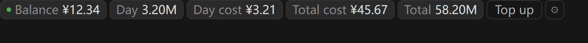
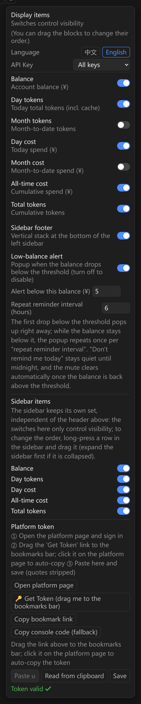
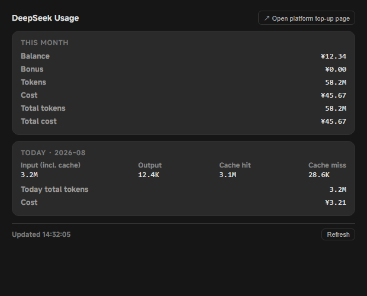
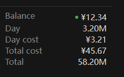

# DSH Deepseek Monitor

[中文](README.md) | **English**

[](https://www.npmjs.com/package/dsh-deepseek-monitor-moyuer233)

---

DeepSeek usage monitor — a **DeepSeek Harness (DSH) plugin**: shows your DeepSeek
platform **balance, day/month/all-time token totals and costs** in the session header,
sidebar and a dedicated "Usage" tab, with drag-to-reorder and per-item toggles.
It also ships an optional **local usage proxy** that precisely meters Anthropic-compatible
sub-agents (e.g. Claude Code).

> ⚠️ This plugin queries your own account data through platform.deepseek.com's
> **internal Web endpoints** (not a public contract) — for personal use only. If the
> platform changes these endpoints, update `lib/platform.mjs` accordingly.

---

## Quick install

```bash
# Install from npm (recommended)
dsh plugin --profile web add dsh-deepseek-monitor-moyuer233

# Or install directly from GitHub
dsh plugin --profile web add github:moyuer233/dsh-deepseek-monitor
```

Then **restart DSH** (the host loads the new bundle at startup; afterwards client-bundle changes hot-reload via HMR — just refresh the page).

---

## Preview

 Session header (horizontal segments)



---

 ⚙ Config panel (toggles + drag to reorder)



---

 "Usage" tab (details)



---

 Sidebar footer (vertical stack)



---

If you find it useful, please ⭐ Star the repo! Issues and Pull Requests are welcome.

---

## Features

- 📊 **Session-header segments**: balance / day tokens / month tokens / day cost /
  month cost / all-time cost / total tokens — each independently toggleable, **≡ drag to reorder**
- 📌 **Three placements**: session header (horizontal), sidebar footer (vertical),
  "Usage" view tab (details)
- 🔄 **60s auto refresh**; config persisted via **dual channels** (localStorage +
  host `config.json`, independent of the app's random port)
- 🔑 **Browser-agnostic token setup**: one-click bookmarklet / console snippet /
  paste-and-save in the panel (quotes auto-stripped, takes effect immediately)
- 🧮 **All-time totals**: cost from the platform `total_costs`, tokens summed month by month with cross-month caching
- 🖥 **Local usage proxy** (optional): intercepts Anthropic-compatible requests and
  parses SSE/JSON usage precisely

---

## Install (DSH plugin)

Standard DSH bundle shape (the repo root is the plugin package — install from GitHub with one command, or from npm once published):

```bash
# Install from npm (recommended)
dsh plugin --profile web add dsh-deepseek-monitor-moyuer233

# Or install directly from GitHub
dsh plugin --profile web add github:moyuer233/dsh-deepseek-monitor
```

> The command installs this repo as a dependency of the profile (`~/.dsh/profiles/web/`);
> its `cordis.patch.yml` automatically injects the `dsm-usage` entry (host routes + browser bundle).

3. **Restart DSH** (host code loads at startup; afterwards client-bundle changes hot-reload via HMR — just refresh the page)

> The legacy manual install (`@local/dsh-host-deepseek-usage` + `@local/dsh-client-ui-deepseek-usage`
> copied into the profile) is superseded by this command. Before upgrading, remove the
> corresponding `- insert:` block from `~/.dsh/profiles/web/cordis.patch.yml` and delete the two
> old directories under `~/.dsh/profiles/node_modules/@local/`.

## Getting the platform token (works in any browser: Edge / Chrome / desktop)

1. Open the ⚙ panel → "Platform token" section
2. Click **Open platform page** and sign in
3. Drag the **🔑 Get Token** link to your bookmarks bar; on the platform page,
   **click the bookmark** to auto-copy the token
   (alternatives: **Copy bookmark link** to create one manually, or **Copy console code** to run in F12)
4. Back in the panel **paste (quotes auto-stripped) → Save** — takes effect immediately, no restart

Saving goes through the host `POST /dsm/token` and atomically writes `~/.dsh/deepseek-monitor/platform-token`.

## Config

- The session header shows tokens/costs grouped by **day / month / total** (balance listed separately);
  drag the **≡ handle** in the ⚙ panel to reorder, toggles control visibility —
  applied to both the header row and the sidebar stack; the "Usage" tab always shows full details
- Config persists to `~/.dsh/deepseek-monitor/config.json` (host-side, port-independent) + localStorage (per session)
- **Language**: switch 中文 / English in the ⚙ panel (default: 中文)

## Data source (platform.deepseek.com internal API)

| Endpoint | Content |
|---|---|
| `GET /api/v0/users/get_user_summary` | balance / bonus / all-time cost |
| `GET /api/v0/usage/amount?month&year` | per-day token usage |
| `GET /api/v0/usage/cost?month&year` | per-day cost |

Auth is the platform login token (browser `userToken`, not an API key).

## Local usage proxy (optional)

Point your sub Claude Code (or any Anthropic-compatible client) `ANTHROPIC_BASE_URL`
at the local proxy; it forwards to DeepSeek and precisely records token usage:

```
client ──▶ proxy (127.0.0.1:8899) ──▶ https://api.deepseek.com/anthropic
               │
               ▼
     usage.jsonl (one record per request: tokens/cost/duration)
```

```bash
node proxy.mjs       # start the proxy (default 127.0.0.1:8899)
node stats.mjs       # totals | today | recent [n] | live | balance
node test/self-test.mjs   # self-test (built-in mock upstream, no real key needed)
```

When wiring up `@deepseek-ai/dsh-subagent-claude-code`, add to the provider row in the profile patch:

```yaml
- id: subagent-claude-code
  name: '@deepseek-ai/dsh-subagent-claude-code'
  config:
    env: !!js Object.fromEntries(Object.entries({
      ANTHROPIC_BASE_URL: 'http://127.0.0.1:8899',
      ANTHROPIC_AUTH_TOKEN: process.env.DEEPSEEK_API_KEY
    }).filter(([, v]) => v !== undefined && v !== ''))
```

## Environment variables

| Variable | Default | Description |
|---|---|---|
| `DS_MONITOR_PORT` | `8899` | proxy listen port |
| `DS_MONITOR_HOST` | `127.0.0.1` | listen address |
| `DS_MONITOR_UPSTREAM` | `https://api.deepseek.com/anthropic` | upstream endpoint |
| `DS_MONITOR_LOG` | `~/.dsh/deepseek-monitor/usage.jsonl` | proxy log file |
| `DS_MONITOR_API_KEY` | falls back to `ANTHROPIC_AUTH_TOKEN`/`DEEPSEEK_API_KEY` | for `stats balance` |
| `DS_PLATFORM_TOKEN` | none | platform token (or write `~/.dsh/deepseek-monitor/platform-token`) |
| `DS_PRICE_<MODEL>_IN/_CACHE_HIT/_OUT` | built-in table | price overrides (CNY per 1M tokens) |

## Pricing (defaults, overridable via `DS_PRICE_*`)

| Model | Input | Cache hit | Output |
|---|---|---|---|
| deepseek-chat | 0.27 | 0.07 | 1.10 |
| deepseek-reasoner | 0.55 | 0.14 | 2.19 |
| deepseek-v4-pro | 1.00 | 0.25 | 3.00 |
| unknown | 1.00 | 0.10 | 2.00 |

Cost follows Anthropic protocol semantics: `cache_creation_input_tokens` is billed at
full input price, `cache_read_input_tokens` at the cache-hit price.

## Example log record

```json
{"ts":"2026-08-15T08:00:00.000Z","runId":"...","kind":"messages","streaming":true,"model":"deepseek-chat","status":200,"inputTokens":1000,"cacheCreation":200,"cacheRead":300,"outputTokens":500,"inputCost":0.00027,"cacheCreationCost":0.000054,"cacheReadCost":0.000021,"outputCost":0.00055,"totalCostCny":0.000895,"error":null,"durationMs":1234}
```

## Known limitations

- The proxy only meters requests **routed through it**; direct DeepSeek traffic is not counted
- `stats balance` uses the native DeepSeek balance endpoint (`https://api.deepseek.com/user/balance`) and needs a valid API key
- Sub-agents are one-shot by design (`dsh-subagent-claude-code` limitation); metering is per-request
- The platform's internal endpoints are not a public contract and may change

---

## License

MIT
