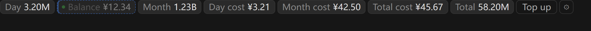
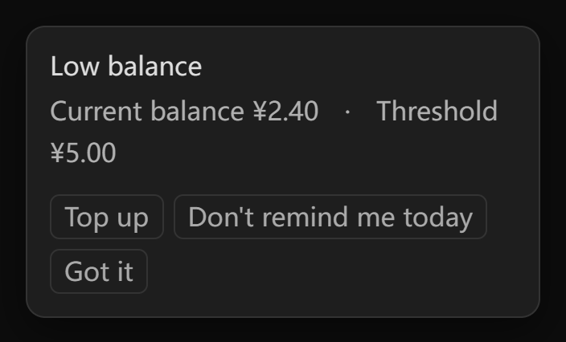

# DSH Deepseek Monitor

_✨ A DeepSeek Harness plugin: balance, token usage and cost at a glance ✨_

  
 
 

[中文](README.md) | **English**

DeepSeek usage monitor — a DeepSeek Harness (DSH) plugin: shows your DeepSeek
platform balance, day/month/all-time token totals and costs in the session header
and sidebar, with long-press drag-to-reorder and per-item toggles.
It also ships an optional local usage proxy that precisely meters Anthropic-compatible
sub-agents (e.g. Claude Code).

> This plugin queries your own account data through platform.deepseek.com's
> internal Web endpoints (not a public contract) — for personal use only. If the
> platform changes these endpoints, update `lib/platform.mjs` accordingly.

## Install (DSH plugin)

Standard DSH bundle shape (the repo root is the plugin package — installable from npm, or from GitHub with one command). Current version `0.2.4`, npm package name `dsh-deepseek-monitor-moyuer233`.

```bash
# Install from npm (recommended)
dsh plugin --profile web add dsh-deepseek-monitor-moyuer233

# Or install directly from GitHub
dsh plugin --profile web add github:moyuer233/dsh-deepseek-monitor
```

Then restart DSH (the host loads the new bundle at startup; afterwards client-bundle changes hot-reload via HMR — just refresh the page).

The command installs this repo as a dependency of the profile (`~/.dsh/profiles/web/`); its `cordis.patch.yml` automatically injects the `dsm-usage` entry (host routes + browser bundle).

> The legacy manual install (`@local/dsh-host-deepseek-usage` + `@local/dsh-client-ui-deepseek-usage`
> copied into the profile) is superseded by the command above. Before upgrading, remove the
> corresponding `- insert:` block from `~/.dsh/profiles/web/cordis.patch.yml` and delete the two
> old directories under `~/.dsh/profiles/node_modules/@local/`.

## Features

- Session-header segments: balance / day tokens / month tokens / day cost / month cost / all-time cost / total tokens — each independently toggleable; **long-press a segment to drag it into place**, and what you see while dragging is what you get
- Two placements: session header (horizontal) and sidebar footer (vertical); click a segment or ⚙ for the full detail panel and settings
- 60s auto refresh (paused while the page is hidden; every placement and tab shares one fetch); config persisted via dual channels (localStorage + host `config.json`, independent of the app's random port)
- Browser-agnostic token setup: one-click bookmarklet / console snippet / paste-and-save in the panel (quotes auto-stripped, takes effect immediately)
- **Per-API-key filtering**: pick "all keys" or a single key in the panel — the same scope as the platform usage page's "API Key" dropdown (all keys by default)
- All-time totals: tokens summed month by month with cross-month caching; cost comes from the account `total_costs` for "all keys", or is summed month by month for the selected key
- Local usage proxy (optional): intercepts Anthropic-compatible requests and parses SSE/JSON usage precisely
- **Low-balance alert**: a popup once the balance drops below your threshold, with one click to the platform top-up page; both the threshold (default ¥5) and the reminder interval (default 6 hours) are editable in the panel, and the whole thing can be switched off

## Preview

Session header (horizontal segments)


Config panel (visibility toggles; reorder by dragging the segments themselves)


Sidebar footer (vertical stack)


Long-press a segment and drag it to reorder (live preview while dragging)



Low-balance alert (one click opens the platform top-up page)



## Getting the platform token (works in any browser: Edge / Chrome / desktop)

1. Open the config panel → "Platform token" section
2. Click "Open platform page" and sign in
3. Drag the "Get Token" link to your bookmarks bar; on the platform page,
   click the bookmark to auto-copy the token
   (alternatives: copy the bookmark link to create one manually, or copy the console code to run in F12)
4. Back in the panel, paste (quotes auto-stripped) → Save — takes effect immediately, no restart

Saving goes through the host `POST /dsm/token` and atomically writes `~/.dsh/deepseek-monitor/platform-token`.

## Config

- The session header shows tokens/costs grouped by day / month / total (balance listed separately);
  **long-press a segment and drag it** to change the order (the sidebar stack follows the same order),
  while the switches in the panel only control visibility —
  applied to both the header row and the sidebar stack
- Config persists to `~/.dsh/deepseek-monitor/config.json` (host-side, port-independent) + localStorage (per session)
- Language: switch 中文 / English in the panel (default: 中文)
- API key: switch between "all keys" and a single key in the panel (same scope as the platform page; all keys by default)

## Data source (platform.deepseek.com internal API)

| Endpoint | Content |
|---|---|
| `GET /api/v0/users/get_user_summary` | balance / bonus / all-time cost (account-level, no key dimension) |
| `GET /api/v0/users/get_api_keys` | the account's API key list |
| `GET /api/v0/usage/by_api_key/amount?start&end&tz` | per-key token usage (second-based window, day-aligned) |
| `GET /api/v0/usage/by_api_key/cost?start&end&tz` | per-key cost |

Auth is the platform login token (browser `userToken`, not an API key).

> 0.2.3 and earlier used `/usage/amount` and `/usage/cost`: those are **account-level**, aggregated by
> model, with **no key dimension**. With more than one key on the account they necessarily report more
> than the platform page does after filtering to a single key — hence 0.2.4 switched to the `by_api_key`
> pair and added a key selector to the panel.

## Local usage proxy (optional)

Point your sub Claude Code (or any Anthropic-compatible client) `ANTHROPIC_BASE_URL`
at the local proxy; it forwards to DeepSeek and precisely records token usage:

```
client ──▶ proxy (127.0.0.1:8899) ──▶ https://api.deepseek.com/anthropic
               │
               ▼
     usage.jsonl (one record per request: tokens/cost/duration)
```

```bash
node proxy.mjs       # start the proxy (default 127.0.0.1:8899)
node stats.mjs       # totals | today | recent [n] | live | balance
npm test             # self-test: proxy + host collector + host routes (built-in mocks, no real key)
```

When wiring up `@deepseek-ai/dsh-subagent-claude-code`, add to the provider row in the profile patch:

```yaml
- id: subagent-claude-code
  name: '@deepseek-ai/dsh-subagent-claude-code'
  config:
    env: !!js Object.fromEntries(Object.entries({
      ANTHROPIC_BASE_URL: 'http://127.0.0.1:8899',
      ANTHROPIC_AUTH_TOKEN: process.env.DEEPSEEK_API_KEY
    }).filter(([, v]) => v !== undefined && v !== ''))
```

## Environment variables

| Variable | Default | Description |
|---|---|---|
| `DS_MONITOR_PORT` | `8899` | proxy listen port |
| `DS_MONITOR_HOST` | `127.0.0.1` | listen address |
| `DS_MONITOR_UPSTREAM` | `https://api.deepseek.com/anthropic` | upstream endpoint |
| `DS_MONITOR_LOG` | `~/.dsh/deepseek-monitor/usage.jsonl` | proxy log file |
| `DS_MONITOR_LOG_MAX_BYTES` | `33554432` (32 MB) | log size cap; the file rotates to `.1` past it |
| `DS_MONITOR_ALLOWED_HOSTS` | loopback names and IP literals only | extra `Host` values allowed to reach the host routes (comma-separated); `*` disables the check |
| `DS_MONITOR_API_KEY` | falls back to `ANTHROPIC_AUTH_TOKEN`/`DEEPSEEK_API_KEY` | for `stats balance` |
| `DS_PLATFORM_TOKEN` | none | platform token (or write `~/.dsh/deepseek-monitor/platform-token`) |
| `DS_MONITOR_TZ_OFFSET` | `8` | bookkeeping timezone offset in hours; the platform buckets days by it |
| `DS_MONITOR_TTL_MS` | `30000` | host-side usage result cache TTL in ms; `0` disables caching |
| `DS_MONITOR_HISTORY_CONCURRENCY` | `6` | max concurrent history-month fetches |
| `DS_PRICE_<MODEL>_IN/_CACHE_HIT/_OUT` | built-in table | price overrides (CNY per 1M tokens) |

## Pricing (defaults, overridable via `DS_PRICE_*`)

| Model | Input | Cache hit | Output |
|---|---|---|---|
| deepseek-chat | 0.27 | 0.07 | 1.10 |
| deepseek-reasoner | 0.55 | 0.14 | 2.19 |
| deepseek-v4-pro | 1.00 | 0.25 | 3.00 |
| unknown | 1.00 | 0.10 | 2.00 |

Cost follows Anthropic protocol semantics: `cache_creation_input_tokens` is billed at
full input price, `cache_read_input_tokens` at the cache-hit price.

## Example log record

```json
{"ts":"2026-08-15T08:00:00.000Z","runId":"...","kind":"messages","streaming":true,"model":"deepseek-chat","status":200,"inputTokens":1000,"cacheCreation":200,"cacheRead":300,"outputTokens":500,"inputCost":0.00027,"cacheCreationCost":0.000054,"cacheReadCost":0.000021,"outputCost":0.00055,"totalCostCny":0.000895,"error":null,"durationMs":1234}
```

## Known limitations

- The proxy only meters requests routed through it; direct DeepSeek traffic is not counted
- `stats balance` uses the native DeepSeek balance endpoint (`https://api.deepseek.com/user/balance`) and needs a valid API key
- Sub-agents are one-shot by design (`dsh-subagent-claude-code` limitation); metering is per-request
- The platform's internal endpoints are not a public contract and may change

## Changelog

### 0.2.4

- Added per-API-key filtering: pick "all keys" or a single key in the panel, matching the platform usage page's "API Key" dropdown (all keys by default)
- Switched the data endpoints to the `by_api_key` pair: `/usage/amount` and `/usage/cost` are account-level with no key dimension, so with multiple keys they necessarily reported more than the platform page does after filtering
- All-time cost still comes from the account `total_costs` for "all keys"; for a selected key it is now summed month by month (the account summary has no key dimension)
- The collection cache / single-flight key now includes the selected key, so switching keys fetches fresh data instead of reusing the previous key's numbers
- Fixed "today" always reading 0: it used to be derived from the account-level monthly response by picking the current day's bucket, and that endpoint does not expose a usable day bucket; it now uses the `by_api_key` day window (`end` computed the platform's own way — midnight after the last day) and matches the platform page
- Session-header segments can be reordered by dragging them directly: long-press for 250 ms to pick one up, the order updates live while dragging (WYSIWYG), and it is saved on release; the config panel no longer reorders via the `≡` handle and only keeps the visibility switches
- Added the "low balance" alert: a popup when the balance drops below your threshold, with one click to the platform top-up page; both the threshold (default ¥5) and the reminder interval (default 6 hours) are editable in the panel, and the alert can be switched off entirely; the muted state is kept locally and clears automatically once the balance recovers
- The config panel now caps its height and scrolls (`min(78vh, 760px)`), so the "Platform token" section at the bottom no longer drops below the window

### 0.2.3

- Security: all three host routes now validate `Host` (loopback names and IP literals only). Previously only `Origin` / `Sec-Fetch-Site` were checked, and DNS rebinding makes both of those look same-origin, so an attacker page could rewrite the config or read usage. Use `DS_MONITOR_ALLOWED_HOSTS` when reaching DSH through a domain or reverse proxy
- Fixed the proxy throwing an uncaught exception — and exiting — on malformed request targets (absolute-form, `OPTIONS *`) when the upstream is configured as "host with port, no path"
- Fixed a single failing history month dragging down balance / today / month into a failed response; the all-time part now degrades on its own, the UI shows "—", and the payload carries `alltimeError`
- Fixed `stats.mjs live` swallowing a partially written line together with its cursor, losing that record forever
- Fixed `stats.mjs` crashing on string-valued log fields
- The proxy now records a request when the client disconnects mid-flight (previously that spent usage was never counted)
- The usage log is size-capped and rotates one generation (`DS_MONITOR_LOG_MAX_BYTES`, default 32 MB); `stats` counts both generations
- UI: requests now time out after 20s, so a stalled host can no longer freeze refreshing forever; nested ternaries removed
- An invalid `DS_MONITOR_TTL_MS` now falls back to the default instead of silently disabling the cache

### 0.2.2

- Fixed "today" being computed from the UTC date, which showed the previous day's data between 00:00 and 08:00 Beijing time (timezone configurable via `DS_MONITOR_TZ_OFFSET`)
- Fixed the proxy classifying `/v1/messages` requests that carry a query string as `other`, recording zero tokens and cost for them
- Fixed multi-byte characters split across TCP chunks (Chinese error messages) being recorded as replacement-character garbage
- Usage collection: 30s host-side cache merging concurrent requests, concurrent history-month fetches, and incremental parsing of the usage log
- UI: every placement and tab shares one fetch; polling pauses while the page is hidden
- Host write endpoints (token / config) now require same-origin JSON; config accepts only scalars and string arrays
- Proxy request bodies are capped at 32 MB; `/dsm/usage` gained a method check and error handling
- Docs: removed the description and screenshots of the "Usage" tab, which no longer exists

### 0.2.1

- Docs only: aligned the English README with the Chinese one (merged the duplicate install section, removed emoji and separators) and added the current version plus this changelog. No functional changes

### 0.2.0

- First npm release: balance and day / month / all-time usage panels, drag-to-reorder and toggles, browser-agnostic token setup, optional local usage proxy, UI language switch

If you find it useful, please give the repo a Star — issues and Pull Requests are welcome.

## License

MIT
